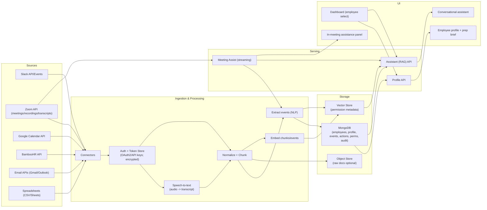

# Architecture — CXO HR Intelligence Dashboard

This is a reference architecture for a **single-org** deployment that is designed to evolve into multi-tenant later.

## 1) Component overview
### Data plane
- **Connectors/Ingestion**
  - BambooHR connector (pull employees/org profile snapshots)
  - Spreadsheet ingestion (CSV/Sheets)
  - Zoom connector (meetings/recordings/transcripts)
  - Slack connector (messages + events)
  - Google Calendar connector (events/attendees)
  - Email connector (Gmail/Outlook)
- **Processing pipeline**
  - (Optional/conditional) **Speech-to-text** (audio → transcript)
  - Normalization → chunking → extraction → embeddings
  - Writes immutable `memory_events` with citations
- **Storage**
  - Operational DB (MongoDB) (employees, official profile, events, action items, permissions, audit)
  - Object store (raw docs, optional)
  - Vector store (embeddings for chunks/events)

### Serving plane
- **Profile API**
  - Gets official + contextual profile
  - Enforces permission filters
- **Assistant API (RAG)**
  - Permission-safe retrieval
  - Answer synthesis with citations
- **Meeting Assist service (streaming)**
  - Consumes live transcript chunks
  - Runs low-latency extraction + retrieval
  - Produces suggestion feed

## 2) Architecture diagram (Mermaid)

## 3) Key design decisions
- **RAG with citations**: the assistant must only use retrieved sources.
- **Event sourcing for memory**: store extracted insights as immutable `memory_events` with confidence + citations.
- **Permission enforcement**: apply at query time (DB filters) and retrieval time (vector metadata filters or index partitioning).
- **Retention controls**: live transcript chunks can be short-lived; events persist.

## 4) In-meeting assistance (latency strategy)
- Process transcript in small chunks (e.g., 5–15 seconds of text).
- Use a lightweight extractor model for event detection; defer heavy summarization.
- Prefetch employee context embeddings at meeting start.
- Produce suggestions in batches, capped (3–7) to reduce overload.

STT-specific notes:
- If live audio is used, run STT in streaming mode and emit timestamped transcript chunks.
- If Zoom provides transcripts, prefer those to reduce latency/cost.
