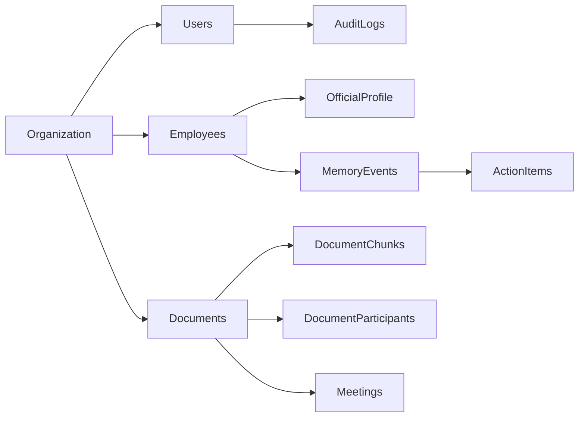

# Data Model — CXO HR Intelligence Dashboard

This document defines a practical schema for building a unified employee profile from BambooHR (HRMS) + spreadsheets + meeting transcripts/recordings, plus Slack, Calendar, and Email— with permission-safe retrieval and in-meeting assistance.

Design principles:
- Store **official HRMS data** separately from **derived context**.
- Derived context is stored as immutable **events** with citations.
- Every record is scoped to a single org now, but includes `org_id` for future multi-tenancy.
- Permission filtering must be enforceable at the storage/retrieval layer.

## 1) Conceptual model
### Core entities
- **Organization**: the tenant boundary.
- **Employee**: the person the CHRO prepares for.
- **User**: the viewer (CHRO/HRBP/etc.) requesting context.
- **Document**: an ingested artifact (HRMS snapshot, spreadsheet, transcript).
- **DocumentChunk**: chunked text for retrieval.
- **MemoryEvent**: extracted atomic insights (action, commitment, concern, topic mention).
- **ActionItem**: trackable follow-up tasks (often derived from MemoryEvent).
- **Meeting**: a specific interaction instance.
- **PermissionPolicy**: role + attribute-based access rules.
- **AuditLog**: traceability for compliance.

### Event types (minimum)
- `meeting_summary`
- `action_item`
- `commitment`
- `topic_mention`
- `concern_signal`
- `sentiment_signal`
- `profile_change` (e.g., role/manager change from HRMS)

## 2) Logical schema (MongoDB-first; implementable in any DB)
This project uses the MERN stack, so the canonical implementation is MongoDB collections with indexes. Field types are indicative.

### 2.1 organizations
- `org_id` (pk, uuid)
- `name`
- `created_at`

### 2.2 users
- `user_id` (pk, uuid)
- `org_id` (fk)
- `email` (unique per org)
- `display_name`
- `role` (enum: `CHRO`, `HRBP`, `PEOPLE_OPS`)
- `created_at`

### 2.3 employees
- `employee_id` (pk, uuid)
- `org_id` (fk)
- `hrms_employee_key` (string, unique per org)
- `work_email` (unique per org)
- `full_name`
- `status` (active/inactive)
- `created_at`

### 2.4 employee_official_profile (HRMS snapshot fields)
- `employee_id` (pk/fk)
- `org_id` (fk)
- `job_title`
- `department`
- `location`
- `manager_employee_id` (nullable fk)
- `hire_date`
- `tenure_months` (derived)
- `updated_at`
- `source_document_id` (fk to documents)

### 2.5 documents
- `document_id` (pk, uuid)
- `org_id` (fk)
- `document_type` (enum: `hrms_snapshot`, `spreadsheet`, `transcript`, `slack_message`, `email_message`, `calendar_event`, `zoom_recording_audio`)
- `source_system` (string: `bamboohr`, `csv_upload`, `google_sheets`, `zoom_export`, `zoom_api`, `slack_api`, `gmail_api`, `outlook_api`, `google_calendar_api`, `stt_whisper`)
- `source_uri` (nullable)
- `content_hash` (for idempotency)
- `ingested_at`
- `retention_policy` (enum or json)
- `sensitivity` (enum: `standard`, `sensitive`)

Optional fields (recommended):
- `external_id` (string)  
  - e.g., Slack message ts, Gmail message id, Calendar event id, Zoom meeting id.

### 2.6 document_participants (maps doc to employees)
- `document_id` (fk)
- `employee_id` (fk)
- `match_method` (enum: `email_exact`, `hrms_key`, `name_fuzzy`)
- `match_confidence` (0..1)
- pk: (`document_id`, `employee_id`)

For Slack/Email/Calendar, a document may map to multiple employees (multiple participants).

### 2.7 document_chunks
- `chunk_id` (pk, uuid)
- `org_id` (fk)
- `document_id` (fk)
- `employee_id` (nullable fk)  
  - populated when the chunk is clearly attributable to one employee; else null.
- `chunk_index`
- `text`
- `token_count`
- `embedding_vector_id` (pointer to vector store)
- `sensitivity` (enum)

STT fields (optional, for audio-derived transcripts and live meeting mode):
- `start_ms` (nullable int)
- `end_ms` (nullable int)

### 2.8 meetings
- `meeting_id` (pk, uuid)
- `org_id` (fk)
- `start_time`
- `end_time`
- `title` (nullable)
- `transcript_document_id` (fk)

### 2.9 memory_events
Immutable extracted facts with citations.
- `event_id` (pk, uuid)
- `org_id` (fk)
- `employee_id` (fk)  
- `event_type` (enum)
- `event_time` (timestamp)  
  - meeting time or document timestamp.
- `summary` (short human-readable)
- `payload` (jsonb)  
  - structured fields per event type (see below).
- `source_document_id` (fk)
- `source_chunk_id` (fk)
- `source_excerpt` (text)
- `confidence` (0..1)
- `sensitivity` (enum)
- `created_at`

#### memory_events.payload examples
- `action_item`: `{ "owner": "CHRO|Employee|Other", "due_date": "YYYY-MM-DD|null", "status": "open|done", "description": "..." }`
- `commitment`: `{ "promisor": "CHRO|Employee|Other", "commitment": "..." }`
- `concern_signal`: `{ "category": "workload|growth|conflict|recognition|compensation|other", "intensity": 1..5 }`
- `topic_mention`: `{ "topic": "career_growth", "keywords": ["promotion", "scope"] }`
- `sentiment_signal`: `{ "score": -1.0..1.0, "method": "model_vX" }`

### 2.10 action_items
Optional denormalization for tracking.
- `action_item_id` (pk, uuid)
- `org_id` (fk)
- `employee_id` (fk)
- `source_event_id` (fk)
- `title`
- `owner_user_id` (nullable fk)
- `due_date` (nullable)
- `status` (open/done)
- `updated_at`

### 2.11 permissions
A simple model that still scales.

#### roles & categories
- `role_permissions`: which roles can see which sensitivity categories.
- `user_overrides`: explicit allow/deny.

Tables:
- `role_permissions`: (`org_id`, `role`, `sensitivity`, `can_view`)
- `user_permissions_override`: (`org_id`, `user_id`, `employee_id`, `sensitivity`, `can_view`)

### 2.12 audit_logs
- `audit_id` (pk, uuid)
- `org_id` (fk)
- `user_id` (fk)
- `action` (enum: `view_profile`, `chat_query`, `ingest_document`, `meeting_assist`) 
- `target_employee_id` (nullable fk)
- `target_document_id` (nullable fk)
- `metadata` (jsonb)
- `created_at`

## 3) Vector store model
Store embeddings for:
- document chunks (`document_chunks.embedding_vector_id`)
- optionally memory events (to retrieve structured insights quickly)

Partitioning:
- MVP (single org): one index
- Scalable: per org + per sensitivity partition, or enforce filtering via metadata.

Required metadata on vectors:
- `org_id`, `document_id`, `employee_id` (nullable), `sensitivity`, `event_time`

Recommended additional metadata:
- `source_system`, `document_type`, `meeting_id` (nullable)

## 4) Mermaid ERD (high-level)

## 5) Notes for in-meeting assistance
In-meeting assistance should write:
- transient live transcript chunks as `documents` + `document_chunks` (retention short)
- extracted `memory_events` (retention longer)
- `audit_logs` for each suggestion batch shown
